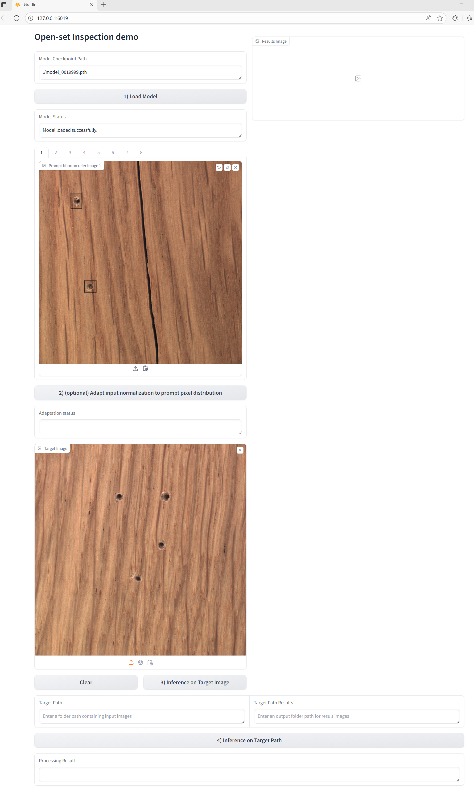

# UniSpector
Towards Universal Open-set Defect Recognition via Spectral-Contrastive Visual Prompting (CVPR 2026)

**[Project](https://geonuk-kimmm.github.io/UniSpector)** · **Paper** *(TBD)*

---

## News
- 🔥 **[2026/04]** We release our code base for training, testing, and demo on our benchmark/tasks, built on [DINOv](https://github.com/UX-Decoder/DINOv). The full UniSpector implementation will be released soon.

---

## Installation
```bash
# 1) Create environment
conda create -n vp-py38 python=3.8 -y
conda activate vp-py38

# 2) Clone repository
git clone https://github.com/geonuk-kimmm/UniSpector
cd UniSpector

# 3) Install dependencies
sh install.sh
```

We used PyTorch 2.4.1 and torchvision 0.19.1 with CUDA / nvcc 12.4 on NVIDIA H100.

---

## Inspect-Anything Dataset Preparation
1.Download original images in benchmark datasets from the links below:
<details>

<summary><strong>Dataset links (click to expand)</strong></summary>

- **GC10**: [Kaggle](https://www.kaggle.com/datasets/alex000kim/gc10det)
- **MagneticTile**: [GitHub](https://github.com/abin24/Magnetic-tile-defect-datasets)
- **Real-IAD**: [Hugging Face](https://huggingface.co/datasets/Real-IAD/Real-IAD)
  - We use the **1024x1024** version: [realiad_1024](https://huggingface.co/datasets/Real-IAD/Real-IAD/tree/main/realiad_1024)
- **MVTec-AD**: [Official Download Page](https://www.mvtec.com/company/research/datasets/mvtec-ad/downloads)
- **3CAD**: [GitHub](https://github.com/EnquanYang2022/3CAD), [Google Drive](https://drive.google.com/file/d/1BIX0H8TZp0wmrAnXPw8_aCAIX1j1Fzwz/view)
- **VISION**: [Hugging Face](https://huggingface.co/datasets/VISION-Workshop/VISION-Datasets)
- **VisA**: [GitHub](https://github.com/amazon-science/spot-diff), [Direct Download](https://amazon-visual-anomaly.s3.us-west-2.amazonaws.com/VisA_20220922.tar)

</details>
<br>
2.Organize the dataset directory using the following structure:
<details>
<summary><strong>Directory layout (click to expand)</strong></summary>

```bash
{dataset_dir}/
├── GC10/ds/img/
│   └── *.jpg
├── MagneticTile/
│   ├── {MagneticTile_category}/Imgs/  # e.g., MT_Blowhole/Imgs/
│   │   └── *.jpg
│   └── ...
├── Real-IAD/realiad-1024/
│   ├── {Real-IAD_product}/NG/  # e.g., audiojack/NG/
│   │   ├── {Real-IAD_defect_code}/{product_id}/  # e.g., BX/S0001/
│   │   │   └── *.jpg
│   │   └── ...
│   └── ...
├── MVTec-AD/
│   ├── {MVTec-AD_product}/test/  # e.g., bottle/test/
│   │   ├── {MVTec-AD_defect_type}/  # e.g., broken_large/
│   │   │   └── *.jpg
│   │   └── ...
│   └── ...
├── 3CAD/
│   ├── {3CAD_product}/test/  # e.g., Aluminum_Camera_Cover/test/
│   │   ├── {3CAD_defect_type}/  # e.g., bruise/
│   │   │   └── *.jpg
│   │   └── ...
│   └── ...
├── VISION/
│   ├── {VISION_product}/  # e.g., Cable/
│   │   ├── train/
│   │   │   └── *.jpg
│   │   └── val/
│   │       └── *.jpg
│   └── ...
└── VisA/
    ├── {VisA_product}/Data/Images/Anomaly/  # e.g., candle/Data/Images/Anomaly/
    │   └── *.jpg
    └── ...
```

</details>
<br>
3.Set the `DETECTRON2_DATASETS` environment variable:

```bash
export DETECTRON2_DATASETS=/path/to/{dataset_dir}
```

4.Download the annotation JSON from [HuggingFace](https://huggingface.co/datasets/geonuk-kimmm/Inspect-Anything). You can store it anywhere; pass the file path to `train_net.py` as `--data_json`.

---


## Training
```bash
python train_net.py --config CONFIG_FILE --data_json DATASET_JSON_PATH
```

- `CONFIG_FILE`: YAML config containing model setting, batch size, learning rate, and other options.
- `DATASET_JSON_PATH`: path to the InsA COCO-format JSON (see step 4 above).

---

## Demo
```bash
python demo_gradio.py --config CONFIG_FILE
```
- `CONFIG_FILE`: YAML config containing model setting.


<p align="left">
  
</p>

You can run inference on a single target image in the UI. For practical scenarios, we also supports iterating over every image under Target Path. Try these features in whatever way fits your own workflow.

---

## Evaluation
```bash
bash sh_scripts/run_evaluation.sh MODEL_SEED MODEL_WEIGHTS SAVEDIR CONFIG_FILE CSV_FILE
```

- `MODEL_SEED`: Training seed (e.g. `42`, `82`, `777`).
- `MODEL_WEIGHTS`: Checkpoint file path.
- `SAVEDIR`: Output subfolder name for this run.
- `CONFIG_FILE`: YAML config path.
- `CSV_FILE`: CSV path; bbox/mask AP rows are appended.

Set `BASE_PATH` in `sh_scripts/run_evaluation.sh` to your InsA annotation root.

---

## Citation
TBU
